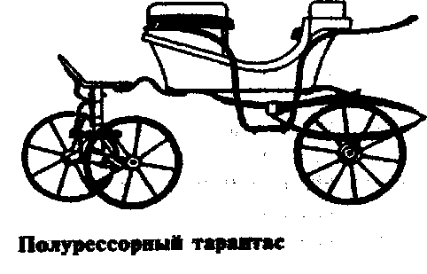

# tarantas
smoothes tex way

> зато не велосипед  © Монополь

Full-fledged reactive-powered bundle of TeX packages for writing lecture notes in Russian.
Equiped with layout-selection machinery, so you don't need to hack deeply inside document code to
reduce margins. See `tex/lyt` subdirectory for sample ones.

## Features (roadmap)

* [X] Think about possible features
* [X] Create a checklist of them

#### Now, serious
* [X] Ease option handling
* [X] Home-made programmable `key=val` parser.
* [X] style-selection machinery
* [X] a nicely organized set of predefined math symbols and hacks
* [X] `key=val`-style options handler
* [X] separate package for theorem and proof styles
* [ ] develop a nice keyval-based numbering machinery
* [ ] `ifluatex`, `ifxetex`
* [ ] enhance existing layouts aestetically
* [ ] new cool layouts
